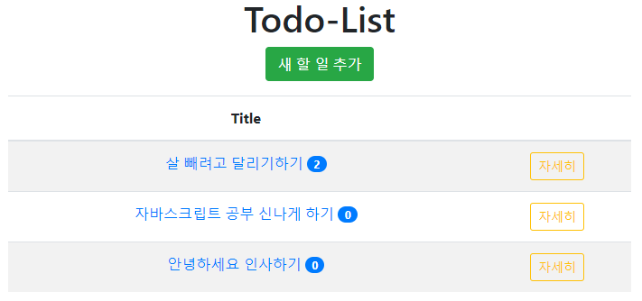

# 실습 과제: Todo-List(댓글 기능 추가)

## 미리 보기



TodoList.ejs


새 할일 추가 Button 클릭 시 입력 창 펼쳐짐


Todo Title 클릭 시 취소선


TodoDetail.ejs : 댓글 추가 및 삭제 기능

## 개요

- Express.js와 MongoDB를 사용하여 서버-클라이언트 간의 데이터 관리를 구현
- 주요 기능은 항목 추가, 수정, 삭제, 완료 상태 변경, 세부 항목 보기, 댓글 관리 등

## 주요 파일 구성

- `app.js`: 서버의 메인 파일로 라우팅과 데이터베이스 연동을 담당
- `views`: EJS 템플릿 파일들 (TodoList.ejs, TodoDetail.ejs, TodoModify.ejs 등)
- `public`: 정적 파일을 제공하는 폴더

## `app.js` 주요 코드 및 설명

### 서버 설정 및 MongoDB 연결 설정

```jsx
const http = require("http");
const express = require("express");
const app = express();
const path = require("path");
const { MongoClient, ObjectId } = require("mongodb");

app.use(express.json());
app.use(express.urlencoded({ extended: false }));
app.use("/", express.static(path.join(__dirname, "public")));

app.set("PORT", 3000);
app.set("view engine", "ejs");
app.set("views", path.join(__dirname, "views"));

// MongoDB 설정
const dbClient = new MongoClient("mongodb://localhost:27017");
const dbName = "todolist";
const collectionName = "todo";
```

- **MongoDB 설정**: `MongoClient`를 사용해 MongoDB와 연결하고, 데이터베이스 이름을 `todolist`, 컬렉션 이름을 `todo`로 설정한다.
- **Express 설정**: 서버는 EJS를 템플릿 엔진으로 사용하며, 정적 파일은 `public` 디렉토리에서 제공한다.

### 목록 보기 기능 (`/todo`)

```jsx
app.get("/todo", async (req, res) => {
    try {
        await dbClient.connect();
        const db = dbClient.db(dbName);
        const todos = db.collection(collectionName);
        const data = todos.find({}, { sort: {}, projection: {} });
        const todoList = await data.toArray();

        req.app.render("TodoList", { todoList }, (err, html) => {
            if (err) throw err;
            res.end(html);
        });
    } finally {
        await dbClient.close();
    }
});
```

- **동작**: MongoDB에서 모든 Todo 항목을 검색하고, 결과를 `TodoList.ejs` 템플릿에 전달하여 렌더링한다.
- **핵심 코드**:
    - `find()`: MongoDB 컬렉션에서 모든 항목을 검색하여 `todoList`에 저장.
    - `req.app.render()`: 템플릿 엔진을 사용해 목록 페이지를 렌더링.

### 상세 보기 기능 (`/todo/detail`)

```jsx
app.get("/todo/detail", async (req, res) => {
    const _id = req.query.id;
    try {
        await dbClient.connect();
        const db = dbClient.db(dbName);
        const todos = db.collection(collectionName);
        const todo = await todos.findOne({ _id: new ObjectId(_id) }, {});

        req.app.render("TodoDetail", { todo }, (err, html) => {
            if (err) throw err;
            res.end(html);
        });
    } finally {
        await dbClient.close();
    }
});
```

- **동작**: URL에서 전달된 ID 값을 사용하여 특정 Todo 항목을 검색하고, `TodoDetail.ejs`에 해당 데이터를 렌더링.
- **핵심 코드**:
    - `findOne()`: MongoDB에서 특정 항목을 검색하여 자세한 정보를 조회.

### 완료 상태 변경 기능 (`/todo/done`)

```jsx
app.get("/todo/done", async (req, res) => {
    const _id = new ObjectId(req.query.id);
    try {
        await dbClient.connect();
        const db = dbClient.db(dbName);
        const todos = db.collection(collectionName);

        const todoItem = await todos.findOne({ _id });
        let revDone = todoItem ? !todoItem.done : false; // done 값 반전

        await todos.updateOne({ _id }, { $set: { done: revDone } });
        res.redirect("/todo");
    } finally {
        await dbClient.close();
    }
});
```

- **동작**: 특정 항목의 `done` 상태를 토글(반전)하여 완료 여부를 업데이트.
- **핵심 코드**:
    - `updateOne()`: 기존 항목의 `done` 값을 반전시키고 이를 데이터베이스에 저장.

### 새 항목 추가 기능 (`/todo/input`)

```jsx
app.post("/todo/input", async (req, res) => {
    try {
        await dbClient.connect();
        const db = dbClient.db(dbName);
        const todos = db.collection(collectionName);
        const { title } = req.body;
        const done = false;
        const reply = [];

        await todos.insertOne({ title, done, reply });
        res.redirect("/todo");
    } finally {
        await dbClient.close();
    }
});
```

- **동작**: 사용자가 입력한 Todo 데이터를 받아 MongoDB에 새 항목으로 추가.
- **핵심 코드**:
    - `insertOne()`: 새로운 Todo 항목을 데이터베이스에 추가.

### 항목 수정 기능 (`/todo/modify`)

```jsx
app.post("/todo/modify", async (req, res) => {
    const { id, title } = req.body;
    const _id = new ObjectId(id);

    try {
        await dbClient.connect();
        const db = dbClient.db(dbName);
        const todos = db.collection(collectionName);

        await todos.updateOne({ _id }, { $set: { title } });
        res.redirect("/todo");
    } finally {
        dbClient.close();
    }
});
```

- **동작**: Todo 항목의 제목을 수정하고, 변경된 내용을 MongoDB에 업데이트.
- **핵심 코드**:
    - `updateOne()`: 특정 항목의 제목을 업데이트하여 데이터베이스에 반영.

### 항목 삭제 기능 (`/todo/delete`)

```jsx
app.get("/todo/delete", async (req, res) => {
    const _id = new ObjectId(req.query.id);

    try {
        await dbClient.connect();
        const db = dbClient.db(dbName);
        const todos = db.collection(collectionName);

        await todos.deleteOne({ _id }, {});
        res.redirect("/todo");
    } finally {
        dbClient.close();
    }
});
```

- **동작**: 특정 항목을 데이터베이스에서 삭제하고, 변경된 목록을 클라이언트에게 반환.
- **핵심 코드**:
    - `deleteOne()`: 지정된 ID에 해당하는 항목을 데이터베이스에서 제거.

### 댓글 추가 및 삭제 기능

- **댓글 추가** (`/todo/reply`): 댓글 데이터를 Todo 항목의 `reply` 배열에 추가하고, 데이터베이스에 업데이트.
- **댓글 삭제** (`/todo/reply`): `replyId`에 해당하는 댓글을 삭제하고, 나머지 댓글만 남겨 업데이트.

```jsx
app.post("/todo/reply", async (req, res) => {
    const { id, newReply } = req.body;
    const _id = new ObjectId(id);

    try {
        await dbClient.connect();
        const db = dbClient.db(dbName);
        const todos = db.collection(collectionName);
        const todo = await todos.findOne({ _id }, {});
        todo.reply.push({ repId: todo.reply.length + 1, context: newReply });

        await todos.updateOne({ _id }, { $set: { reply: todo.reply } });
        res.redirect("/todo/detail/?id=" + todo._id);
    } finally {
        dbClient.close();
    }
});
```

## EJS 템플릿 (클라이언트 측 UI)

### TodoList.ejs

- **목록 UI**: Todo 항목의 제목과 완료 상태를 보여주며, 각 항목에 대한 자세한 정보로 이동할 수 있는 링크 제공.
- **기능 추가**: 새 항목을 바로 추가할 수 있는 폼과 완료 상태를 확인할 수 있는 UI 요소 포함.

### TodoDetail.ejs

- **세부 항목 UI**: 선택된 Todo 항목의 세부 정보를 표시하고, 수정 및 삭제 기능 제공.
- **댓글 관리**: 댓글을 추가 및 삭제할 수 있는 기능 구현.

### TodoModify.ejs

- **수정 UI**: 기존 항목의 내용을 수정할 수 있는 입력 폼을 제공.

## 결론

- Express.js와 MongoDB를 사용하여 데이터의 CRUD(생성, 읽기, 업데이트, 삭제) 작업을 구현
- 각 작업은 클라이언트와 서버 간의 상호작용을 통해 처리
- EJS 템플릿을 사용하여 동적으로 데이터를 렌더링하고 표시
- 확장성과 유지보수성을 높이는 데 도움이 될 수 있는 구조이다.